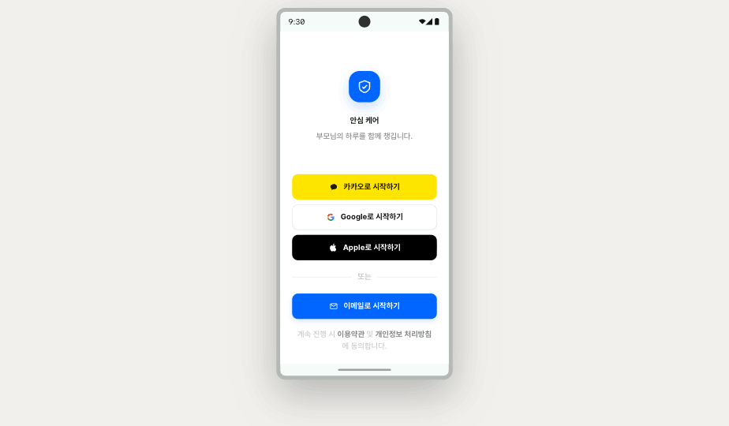
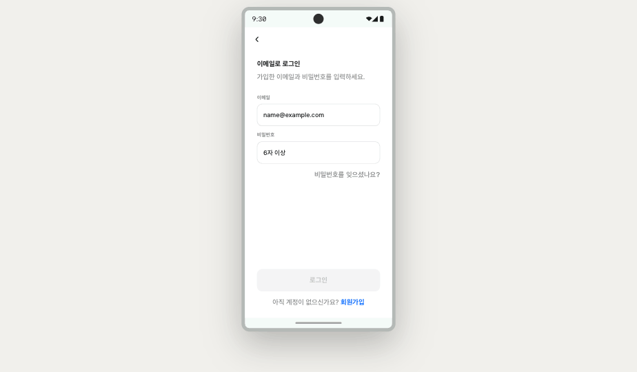

# Handoff: 안심 케어 · 로그인 화면

## Preview

| 1 · Login | 2 · Email Login |
|---|---|
|  |  |

## Overview
보호자가 안심 케어 트래커 앱에 진입하기 위한 첫 화면입니다. **소셜 로그인 3종(카카오 / Google / Apple)** 과 **이메일 로그인**을 제공하며, 이메일 버튼을 누르면 이메일·비밀번호 입력 화면으로 전환됩니다.

타깃 사용자: 부모님·고령 가족을 돌보는 보호자. 톤은 신뢰감 있는 의료/금융 계열 — 정보 밀도 높고 정돈된 느낌.

## About the Design Files
이 폴더의 `Login.html`은 **디자인 레퍼런스 (HTML 프로토타입)** 입니다. 그대로 프로덕션에 쓰지 마시고, **타깃 코드베이스의 환경에 맞게 다시 구현**해주세요.

- PRD상 타깃 플랫폼은 **Flutter + Material Design 3**입니다 (`CareTrackerApp` 위젯).
- 코드베이스가 이미 있다면 그 환경의 패턴/라이브러리를 따르세요. (Flutter면 `Material`/`flutter_signin_button` 등, RN이면 `expo-auth-session`, 웹이라면 React 등)
- 아직 환경이 없다면 PRD에 따라 Flutter로 구현하시는 것을 권장합니다.

## Fidelity
**High-fidelity (hifi)** — 컬러, 타이포그래피, 여백, 모서리값, 상호작용까지 모두 최종안 수준으로 구체화되어 있습니다. 코드베이스의 기존 디자인 시스템을 따르되, 가능한 한 픽셀 단위로 동일하게 재현해주세요.

기반 디자인 시스템: **Wanted Design System** (CC BY 4.0, © Wanted Lab Inc.) — `wanted/colors_and_type.css` 참고.

---

## Screens / Views

이 핸드오프에는 **두 개의 스크린**이 있습니다.

### Screen 1 · `LoginScreen` (소셜 + 이메일 시작)

#### Purpose
앱 첫 진입 시 노출. 사용자는 카카오 / Google / Apple / 이메일 중 하나를 선택해 인증을 시작합니다.

#### Layout
- 디바이스: Android, 360 × 760 (디자인 기준)
- 배경: `#FFFFFF` (white)
- 세로 플로우, 영역 3개로 구성:
  1. **브랜드 영역** (flex: 1, center) — 로고 + 앱 이름 + 태그라인
  2. **버튼 영역** (padding `0 24px 12px`) — 4개 버튼 + divider
  3. **푸터** (padding `8px 28px 24px`, center) — 약관/개인정보 동의 안내문
- 모든 텍스트는 한국어. 폰트는 Pretendard (regular 400 / medium 500 / bold 700).

#### Components

**Brand Mark**
- 컨테이너: flex column, gap 18px, items center
- 로고 박스: `64 × 64`, `border-radius: 22px`, background `var(--primary-normal)` = `#0066FF`, shadow `0 10px 24px rgba(0,102,255,0.22)`
- 로고 아이콘: shield + check, stroke `#FFFFFF`, `stroke-width: 1.8`, `size: 32`
- 앱 이름 `안심 케어`: `font-size: 26px`, `font-weight: 700`, `letter-spacing: -0.022em`, `color: var(--label-strong)` = `#171719`
- 태그라인 `부모님의 하루를 함께 챙깁니다.`: `font-size: 14px`, `font-weight: 500`, `color: var(--label-neutral)` = `rgba(55,56,60,0.61)`, margin-top 8px

**AuthButton** (공통 사양)
- 크기: `width: 100%`, `height: 52px`
- `border-radius: 12px`
- 콘텐츠: 아이콘(20px wrapper) + 라벨 (gap 10px), center 정렬
- 라벨 폰트: `font-size: 15px`, `font-weight: 700`, `letter-spacing: -0.005em`
- 누를 때 `transform: scale(0.98)`, 120ms `var(--ease-standard)`

| 버튼 | 배경 | 텍스트 색 | 보더 | 아이콘 | 라벨 |
|---|---|---|---|---|---|
| 카카오 | `#FEE500` | `#191600` | 없음 | 카카오 말풍선 로고 (fill `#191600`) | `카카오로 시작하기` |
| Google | `#FFFFFF` | `var(--label-strong)` `#171719` | `1px solid var(--line-normal-normal)` | 4컬러 G 로고 | `Google로 시작하기` |
| Apple | `#000000` | `#FFFFFF` | 없음 | 사과 로고 (fill `#FFFFFF`) | `Apple로 시작하기` |
| 이메일 (primary) | `var(--primary-normal)` `#0066FF` | `#FFFFFF` | 없음 | 메일 아이콘 (stroke `#FFFFFF`, `stroke-width: 1.8`) | `이메일로 시작하기` |

이메일 버튼만 그림자 추가: `box-shadow: 0 4px 12px rgba(0,102,255,0.18)`.

**Divider (소셜과 이메일 사이)**
- 가로 라인 2개 + 가운데 텍스트 `또는`
- 라인: `height: 1px`, `background: var(--line-normal-neutral)` = `rgba(112,115,124,0.16)`
- 텍스트: `font-size: 11px`, `font-weight: 600`, `letter-spacing: 0.06em`, `color: var(--label-alternative)` = `rgba(55,56,60,0.28)`
- gap 12px, vertical padding 12px

**Footer**
- 안내문 `계속 진행 시 이용약관 및 개인정보 처리방침에 동의합니다.`
- 본문 컬러: `var(--label-alternative)` `rgba(55,56,60,0.28)`
- "이용약관" / "개인정보 처리방침" 강조: `color: var(--label-neutral)` `rgba(55,56,60,0.61)`, `font-weight: 600` (탭 가능한 링크로 구현)
- `font-size: 11px`, `line-height: 1.55`, center 정렬

**Toast (소셜 버튼 탭 시)**
- 위치: 화면 하단에서 96px 위, 좌우 중앙
- 배경: `var(--label-strong)` `#171719`
- 텍스트: `#FFFFFF`, `font-size: 13px`, `font-weight: 600`
- `padding: 10px 16px`, `border-radius: 999px`
- shadow `0 8px 24px rgba(0,0,0,0.2)`
- 진입 애니메이션: 240ms ease — opacity 0→1, translateY 8px→0
- 표시 내용: `{공급자명}로 로그인하는 중…` (예: `Google로 로그인하는 중…`)
- 자동 해제: 2400ms 후 사라짐

---

### Screen 2 · `EmailLoginScreen`

#### Purpose
이메일 버튼 탭 후 진입. 이메일과 비밀번호를 입력해 로그인합니다.

#### Layout
- 배경 `#FFFFFF`, 세로 플로우.
- 상단 바: padding `8px 8px 0`, 뒤로가기 버튼 1개 (40×40 원형 버튼, `var(--label-strong)` 컬러)
- 본문: padding `20px 28px 0`, flex column

#### Components

**Header**
- 제목 `이메일로 로그인`: `font-size: 24px`, `font-weight: 700`, `letter-spacing: -0.022em`, `color: var(--label-strong)`, `line-height: 1.25`
- 설명 `가입한 이메일과 비밀번호를 입력하세요.`: `font-size: 13.5px`, `font-weight: 500`, `color: var(--label-neutral)`, `line-height: 1.5`, margin-top 6px

**Field** (라벨 + 인풋)
- gap 6px (label과 input 사이)
- 라벨: `font-size: 11.5px`, `font-weight: 700`, `letter-spacing: 0.04em`, `color: var(--label-neutral)`
- 인풋: `height: 50px`, `padding: 0 14px`, `border-radius: 12px`, `background: #FFFFFF`
  - 기본 보더: `1px solid var(--line-normal-normal)` = `rgba(112,115,124,0.22)`
  - 포커스: `border: 1px solid var(--primary-normal)`, `box-shadow: 0 0 0 3px rgba(0,102,255,0.10)`
  - 폰트: `font-size: 15px`, `font-weight: 500`, `color: var(--label-strong)`
  - 전환: 120ms

두 필드:
1. `이메일` — `type="email"`, placeholder `name@example.com`
2. `비밀번호` — `type="password"`, placeholder `6자 이상`

**Forgot password 링크**
- `비밀번호를 잊으셨나요?`
- 오른쪽 정렬, `font-size: 12.5px`, `font-weight: 600`, `color: var(--label-neutral)`
- margin-top 14px

**Submit button (`로그인`)**
- `height: 52px`, `border-radius: 12px`, `font-size: 15px`, `font-weight: 700`
- 활성 (유효): background `var(--primary-normal)` `#0066FF`, color `#FFFFFF`
- 비활성: background `var(--fill-neutral)` `rgba(112,115,124,0.08)`, color `var(--label-alternative)`, `cursor: not-allowed`
- 유효성 규칙: `email.includes('@') && password.length >= 6` (목업 수준 — 실제 구현은 정식 정규식 사용 권장)

**Signup link**
- `아직 계정이 없으신가요? 회원가입`
- center 정렬, padding `14px 0 24px`
- 안내 텍스트: `font-size: 13px`, `font-weight: 500`, `color: var(--label-neutral)`
- "회원가입" 링크: `font-size: 13px`, `font-weight: 700`, `color: var(--primary-normal)`

---

## Interactions & Behavior

### LoginScreen
- **카카오 / Google / Apple 버튼 클릭**: 토스트 표시 (위 Toast 사양 참조) → 실제 구현 시 각 공급자 OAuth 플로우 호출
  - 카카오: Kakao SDK / `kakao_flutter_sdk` 사용
  - Google: Google Sign-In SDK / `google_sign_in`
  - Apple: Sign in with Apple / `sign_in_with_apple` (iOS 필수, Android는 fallback OAuth)
- **이메일 버튼 클릭**: `EmailLoginScreen`으로 전환 (별도 라우트 또는 inner state)
- **이용약관 / 개인정보 처리방침 텍스트 클릭**: 각각 약관 화면으로 라우팅 (이번 핸드오프 범위 밖)

### EmailLoginScreen
- **뒤로가기 버튼**: 이전 화면(`LoginScreen`)으로
- **인풋 포커스**: 보더 색 + 보더 외곽 글로우 트랜지션 (120ms)
- **로그인 버튼**: 입력값이 유효할 때만 활성. 클릭 시 인증 API 호출
- **비밀번호 잊으셨나요? / 회원가입 링크**: 별도 화면으로 라우팅

### Animations
- 버튼 press: `transform: scale(0.98)`, 120ms `cubic-bezier(0.4, 0, 0.2, 1)`
- Toast 진입: 240ms — opacity + translateY
- Input focus 트랜지션: 120ms

---

## State Management

### LoginScreen
- `status: { provider, label } | null` — 토스트 표시용 (2400ms 후 null로 초기화)
- `showEmail: boolean` — 이메일 화면 전환 플래그 (라우터 사용 시 불필요)

### EmailLoginScreen
- `email: string`
- `password: string`
- `valid` (파생 상태): `email.includes('@') && password.length >= 6`

### 실제 구현 시 추가 고려
- 인증 로딩 상태 (`isAuthenticating`)
- 에러 상태 (`authError: string | null`)
- 세션 토큰 보관 (Flutter면 `flutter_secure_storage`)
- 이미 로그인한 사용자는 LoginScreen 스킵하고 홈으로 이동

---

## Design Tokens

`wanted/colors_and_type.css` 참고. 핵심값만 발췌:

### Colors
| 토큰 | 값 | 용도 |
|---|---|---|
| `--primary-normal` | `#0066FF` | 메인 액션 (이메일 버튼, 포커스 보더, primary 링크) |
| `--label-strong` | `#171719` | 헤딩, 강조 본문 |
| `--label-normal` | `rgba(46,47,51,0.88)` | 본문 |
| `--label-neutral` | `rgba(55,56,60,0.61)` | 보조 본문 |
| `--label-alternative` | `rgba(55,56,60,0.28)` | 캡션, 비활성 텍스트 |
| `--line-normal-normal` | `rgba(112,115,124,0.22)` | 인풋·버튼 보더 |
| `--line-normal-neutral` | `rgba(112,115,124,0.16)` | 디바이더 |
| `--fill-neutral` | `rgba(112,115,124,0.08)` | 비활성 버튼 배경 |

### Brand color
- 카카오: `#FEE500` (bg), `#191600` (fg)
- Apple: `#000000` (bg), `#FFFFFF` (fg)
- Google: `#FFFFFF` (bg), 정식 4컬러 G 로고

### Typography
- 패밀리: `Pretendard` — Light(300) / Regular(400) / Medium(500) / Bold(600-700)
- 폴백: `-apple-system, BlinkMacSystemFont, system-ui, "Apple SD Gothic Neo", "Noto Sans KR", sans-serif`

### Spacing
- 사이드 패딩(버튼 영역): 24px
- 사이드 패딩(폼 영역): 28px
- 버튼 간격: 10px
- 디바이더 vertical padding: 12px

### Radius
- 버튼·인풋: `12px`
- 로고 박스: `22px`
- 토스트: `999px` (pill)

### Shadows
- Primary 버튼: `0 4px 12px rgba(0,102,255,0.18)`
- 로고: `0 10px 24px rgba(0,102,255,0.22)`
- 토스트: `0 8px 24px rgba(0,0,0,0.2)`
- 포커스 글로우: `0 0 0 3px rgba(0,102,255,0.10)`

### Motion
- `--ease-standard: cubic-bezier(0.4, 0, 0.2, 1)`
- 빠른 트랜지션: 120ms
- 기본: 150–200ms
- 토스트: 240ms

---

## Assets

이 디자인에서 쓰인 모든 시각 요소는 **인라인 SVG**로 그려져 있습니다 (외부 이미지 없음).

- **로고 아이콘** — shield + check (자체 그림). 정식 브랜드 로고로 교체 권장.
- **카카오 로고** — 카카오 가이드라인 기준 말풍선 모양. 정식 사용 시 [Kakao Developers 디자인 가이드](https://developers.kakao.com/docs/latest/ko/kakaologin/design-guide) 준수 필수 (버튼 크기·여백·로고 클리어 스페이스 규정).
- **Google G 로고** — 정식 4컬러. [Google Identity 브랜딩 가이드](https://developers.google.com/identity/branding-guidelines) 준수 필수.
- **Apple 로고** — [Apple Human Interface Guidelines / Sign in with Apple](https://developer.apple.com/design/human-interface-guidelines/sign-in-with-apple) 준수 필수 (Apple 인증을 제공하면 다른 소셜 로그인도 함께 제공해야 한다는 규정 있음 — 본 디자인은 충족).
- **폰트 (Pretendard)** — [Pretendard GitHub](https://github.com/orioncactus/pretendard), OFL 1.1. 셀프 호스팅 또는 npm `pretendard` 사용.

⚠️ 각 소셜 로그인 SDK 사용 시 해당 플랫폼의 **버튼 디자인 가이드라인을 반드시 검수**하세요. 본 디자인은 가이드라인의 색·로고 사양을 따랐지만, 라벨 문구(`OO로 시작하기`)와 라운드 반경(12px)은 가이드라인의 권장 범위 안에서 조정한 것입니다.

---

## Files

핸드오프 폴더 구성:
```
design_handoff_login/
├── README.md            ← (이 파일)
├── Login.html           ← React + Babel 인라인. 두 화면 모두 포함.
├── screenshots/
│   ├── 01-login.png         ← 소셜 + 이메일 시작 화면
│   └── 02-email-login.png   ← 이메일 로그인 화면
└── wanted/
    └── colors_and_type.css   ← 디자인 토큰 (CSS 변수)
```

`Login.html`은 React 18 + Babel inline 환경에서 동작합니다. 브라우저에서 직접 열어 인터랙션을 확인할 수 있습니다.

핵심 컴포넌트 (`Login.html` 내부):
- `<Login>` — 진입점. `showEmail` state로 두 화면 전환
- `<BrandMark>` — 로고 + 앱 이름 + 태그라인
- `<AuthButton>` — 4개 버튼 공통 컴포넌트
- `<Toast>` — 소셜 버튼 탭 시 표시
- `<EmailLogin>` — 이메일 화면
- `<Field>` — 라벨 + 인풋 페어

---

## Recommended Implementation Order

1. **디자인 토큰 셋업** — `colors_and_type.css`의 CSS 변수를 타깃 코드베이스의 테마 시스템(Flutter `ThemeData`, React Theme, etc.)에 매핑
2. **공통 컴포넌트** — `AuthButton`, `Field`, `Toast`
3. **LoginScreen** 정적 레이아웃
4. **EmailLoginScreen** 정적 레이아웃 + 폼 유효성
5. **소셜 SDK 통합** — 카카오 → Google → Apple 순 권장 (Apple은 iOS 의존성 가장 큼)
6. **에러/로딩 상태** 처리
7. **세션 저장** 및 자동 로그인 분기

각 SDK 연동 후에는 가이드라인 검수를 한 번 더 돌려주세요.
